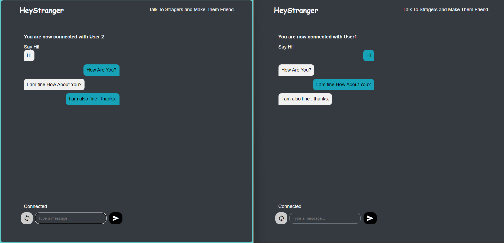

# Hey Stranger Frontend

Welcome to the frontend repository for the Hey Stranger application.

<!-- ## Table of Contents
- [Introduction](#introduction)
- [Features](#features)
- [Installation](#installation)
- [Usage](#usage)
- [Contributing](#contributing)
- [License](#license) -->

## Introduction
Hey Stranger is a web application designed to connect people from around the world. This repository contains the frontend code built with modern web technologies.
## Features

- Real-time chat
- Chat with interests
- Video chat with interests

## Technologies Used
- WebRTC
- Socket.io

## Installation
To get started with the project, clone the repository and install the dependencies:

```bash
git clone https://github.com/yourusername/heyStranger_frontend.git
cd heyStranger_frontend
```

<!-- ## Usage
Run the development server:

```bash
npm start
``` -->

## Usage

To start the development server, use the Live Server extension and navigate to `http://localhost:5500`.

## Output


## Contributing
We welcome contributions! Please read our [contributing guidelines](CONTRIBUTING.md) for more details.

## License
This project is licensed under the MIT License. See the [LICENSE](LICENSE) file for more information.


